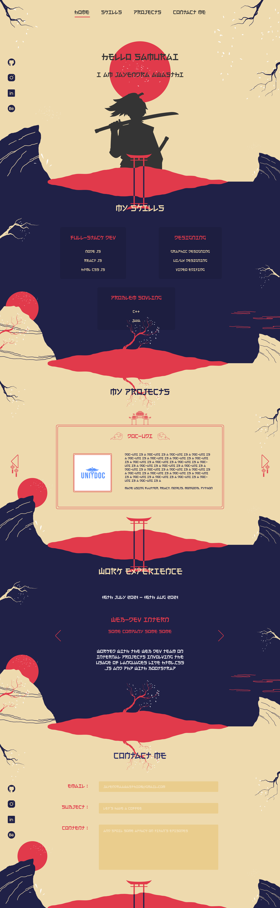

# Hello Samurai

Персональный сайт-портфолио frontend-разработчика в самурайской стилистике. Проект сочетает японскую визуальную концепцию с интерактивным React-интерфейсом и содержит секции с навыками, проектами, опытом работы, социальными сетями и контактной формой.

## О проекте

* Главная страница с приветственным экраном и анимированным текстом.
* Навигация по основным секциям портфолио.
* Блок с социальными сетями.
* Раздел с профессиональными навыками.
* Секция с реализованными проектами.
* Блок с опытом работы.
* Контактная форма для связи.
* Единый визуальный стиль в японской и самурайской эстетике.
* Анимационные эффекты и интерактивные элементы интерфейса.

## Реализованные темы

* Компонентная архитектура React.
* `useState` и `useEffect`.
* Динамический вывод данных через `map()`.
* Обработка пользовательских событий.
* Анимация печати текста.
* Управление активными состояниями интерфейса.
* Работа с CSS-классами и CSS-переменными из React.
* Создание интерактивной контактной формы.
* Якорная навигация между секциями.


## Структура компонентов

* `App` — главный компонент, объединяющий все секции.
* `Nav` — навигация по разделам сайта и управление активным пунктом.
* `Header` — приветственный экран с анимацией печати.
* `Social` — ссылки на социальные сети.
* `Skills` — список профессиональных навыков.
* `Project` — отображение проектов.
* `Experience` — информация об опыте работы.
* `Contact` — контактная форма.

## Основные технологии

* **React** — создание компонентного интерфейса.
* **JavaScript** — логика и интерактивность.
* **JSX** — построение интерфейса внутри React-компонентов.
* **CSS** — оформление, анимации и визуальная стилизация.
* **HTML** — структура элементов страницы.
* **SVG** — использование векторной графики.
* **Vite** — сборка и запуск проекта.

## Цель проекта

Практика разработки интерактивного React-портфолио с компонентной архитектурой, управлением состоянием, анимациями, динамическим отображением данных и созданием пользовательского интерфейса в нестандартной визуальной стилистике.

## Дизайн

[Открыть макет проекта в Figma](https://www.figma.com/design/2e0cyJP98RKs24zjFJNrtM/Japanese-themed-portfolio--Community---Copy-?node-id=1-2&t=ZYbeVetOdEUMnqKg-1)

## Скриншот

<details>
<summary><strong>Скриншот проекта</strong></summary>



</details>

## Запуск проекта

### 1. Клонирование репозитория

```bash
git clone https://github.com/voidlord96-rgb/Hello-Samurai.git
```

### 2. Переход в папку проекта

```bash
cd Hello-Samurai
```

### 3. Установка зависимостей

```bash
npm install
```

### 4. Запуск проекта

```bash
npm run dev
```

После запуска откройте адрес, который Vite покажет в терминале, обычно:

```text
http://localhost:5173/
```
